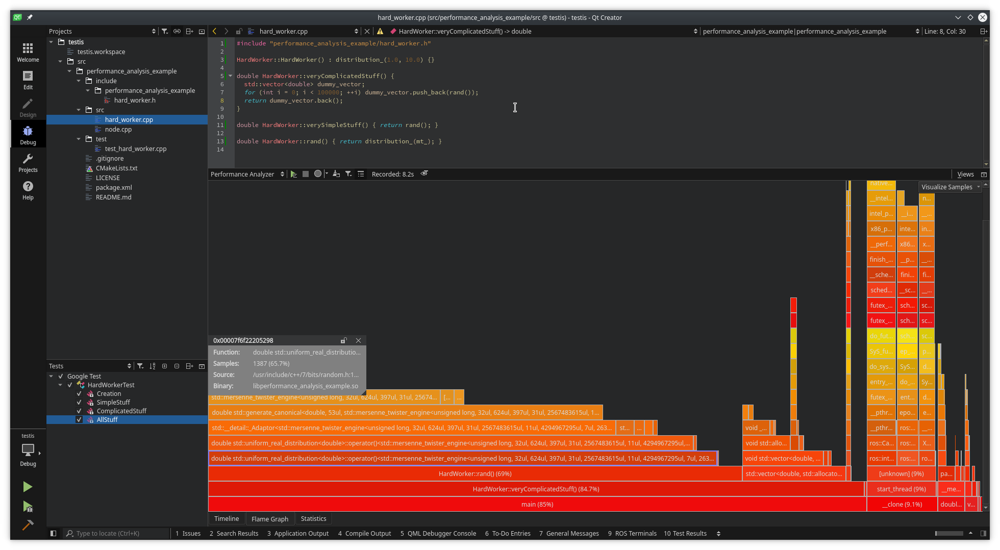
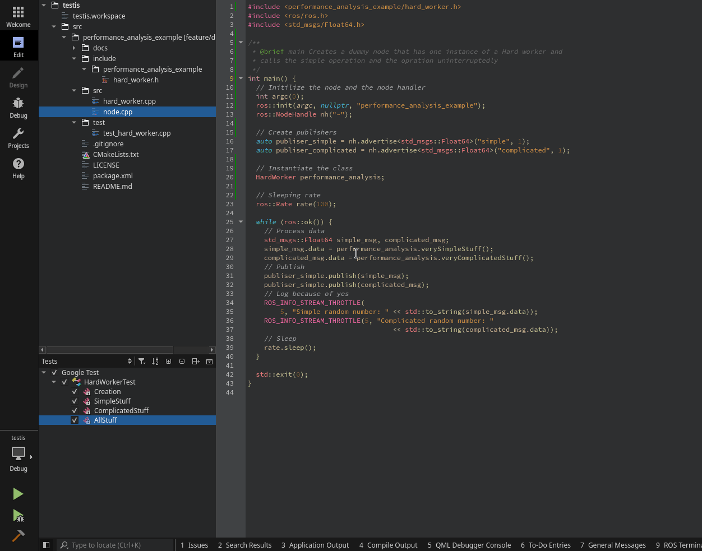
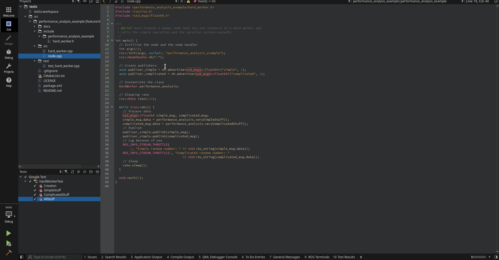
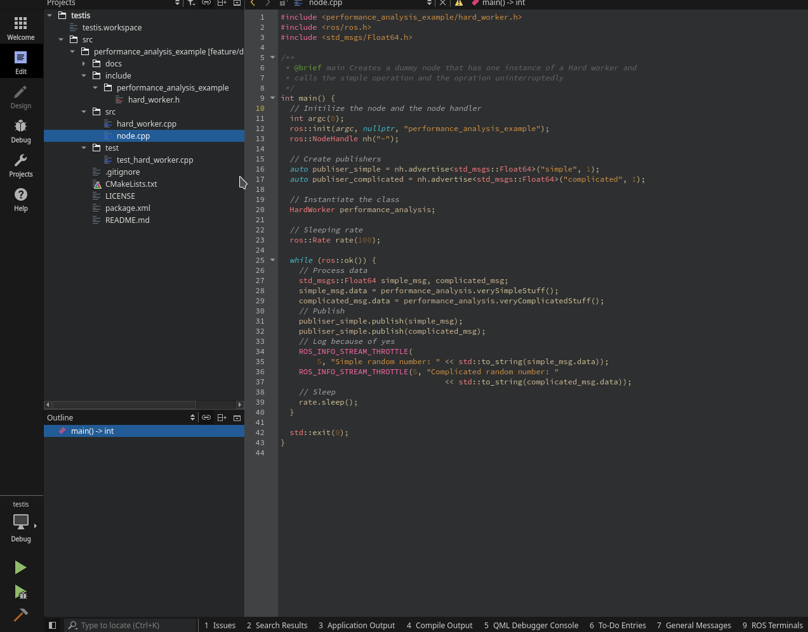

# What is this?
This repo is meant to be cloned locally and be used as an example on how to run performance analysis with QtCreator and the ROS plugin. This is useful to measure how much resources an operation is taking. Meaning... you can use it to optimize your code.

# Whhaaaat?
There is a tool called [perf](https://en.wikipedia.org/wiki/Perf_(Linux)) that can collect data of the system. This can be targeted to collect data of your program and then parse that dump of data to be visualized. The parser is called [perfparser](https://code.qt.io/cgit/qt-creator/perfparser.git/tree/) from the Qt people and, along with it, they have also developed a plugin to visualize data directly in the IDE as shown in the image above. However this data can be visualized with other programs as the KDAB people show with the project [Hotspot](https://github.com/KDAB/hotspot).

# Shut up and show me!

## Setup
1. Clone the repo in a workspace.
2. Install Qt Creator with the ROS plugin by [dowloading the latest version](https://github.com/ros-industrial/ros_qtc_plugin/releases).
3. Setup the workspace in QtCreator. For that follow the [original wiki](https://ros-qtc-plugin.readthedocs.io/en/latest/).
4. Compile (Shortcut with Ctrl+B)
5. Add the custom executable. With catkin, all executables are outputed under *<workspace>/devel/lib/<my_package>*. We will create a configuration in QtCreator so it can use it.

## Performance analysis
1. Go to the debug view
2. Change the tool to **Performance Analyzer**
3. Start the debug session with the play button. The program should run.
4. Start recording data by pressing the red circle.
5. Stop recording data by pressing the red circle again.
6. Stop the node (if you want to, this step assumes free will).
7. Et voila!

In the gif below it can be seen how the *veryComplicatedStuff* function is taking 85% of the execution of the process.

# Bonus: Running tests from QtCreator
Qt Creator also supports Google Tests natively and you can, not only run an specific test from the IDE but also debug it!. To do so:

1. Compile the tests with `catkin run_tests <my_package>`. This will generate a binary with the tests.
2. Add the custom executable. As before, create a custom executable but, this time, the target should be the previously generated binary.
3. Go the Tests view and make use of it.
4. When running the tests, it will ask about which *Custom executable* to use. Select the one created right now.

